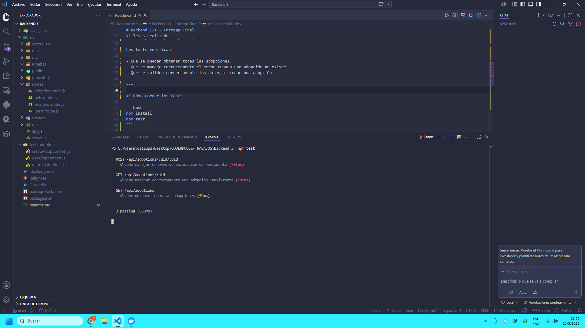
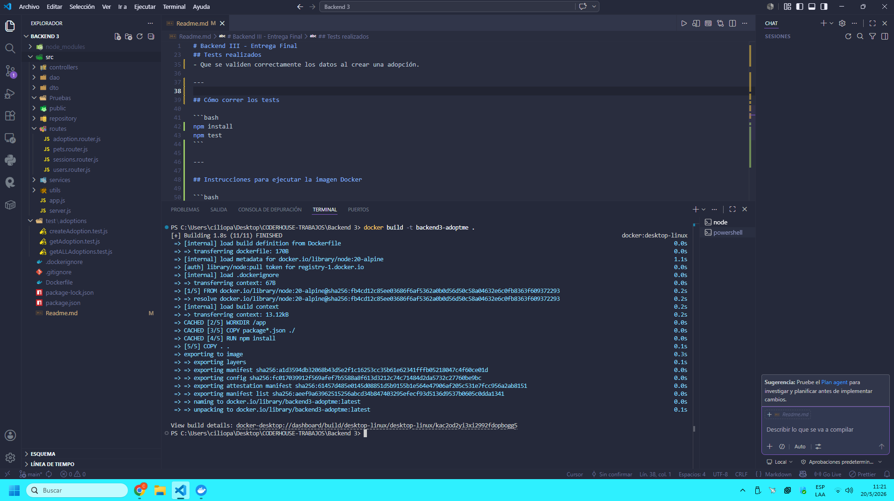
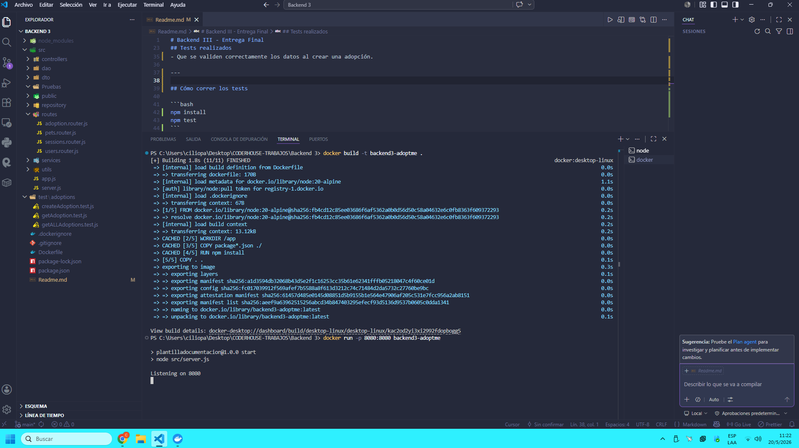
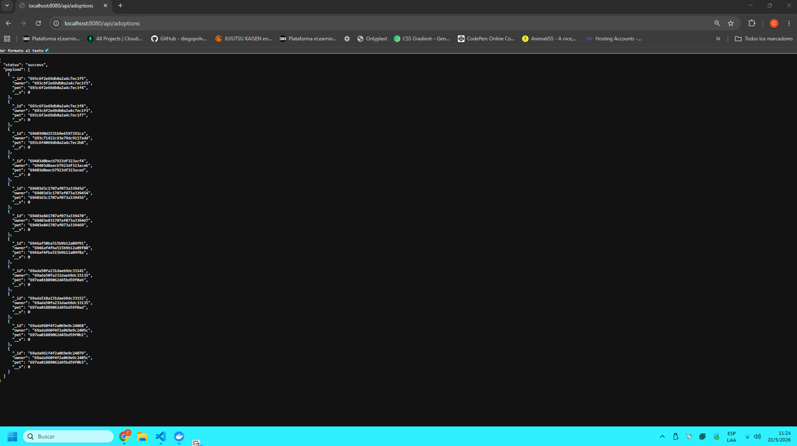

# Backend III - Entrega Final

## Descripción

Este es el proyecto final de Backend III. En este trabajo hice los tests funcionales del router `adoption.router.js`, armé el Dockerfile para dockerizar la aplicación y subí la imagen a DockerHub.

---

## Repositorio del proyecto

GitHub:
https://github.com/CilioCristian/EntregaFinalBackendIII

---

## Imagen en DockerHub

DockerHub:
https://hub.docker.com/r/cristiancilio/backend3-adoptme

---

## Tests realizados

Se probaron los siguientes endpoints:

- GET `/api/adoptions`
- GET `/api/adoptions/:aid`
- POST `/api/adoptions/:uid/:pid`

Los tests verifican:

- Que se puedan obtener todas las adopciones.
- Que se maneje correctamente el error cuando una adopción no existe.
- Que se validen correctamente los datos al crear una adopción.

---

## Cómo correr los tests

```bash
npm install
npm test
```

---

## Instrucciones para ejecutar la imagen Docker

```bash
docker build -t backend3-adoptme . 
docker run -p 8080:8080 backend3-adoptme 
```

### Una vez levantado el contenedor, abris en el navegador:

http://localhost:8080/api/adoptions

### Si todo funciona correctamente, la aplicación responde con un JSON con status: "success" y el listado de adopciones.

---

## Evidencia de pruebas

### Resultado de los tests



### Construcción de la imagen Docker



### Ejecución del contenedor



### Aplicación funcionando en Docker



---


